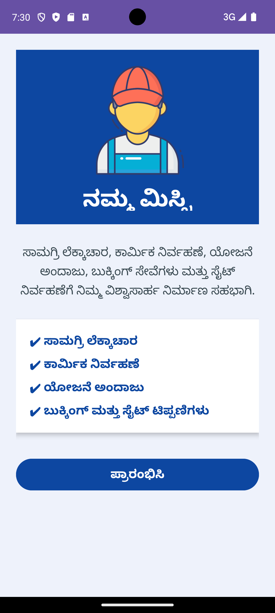
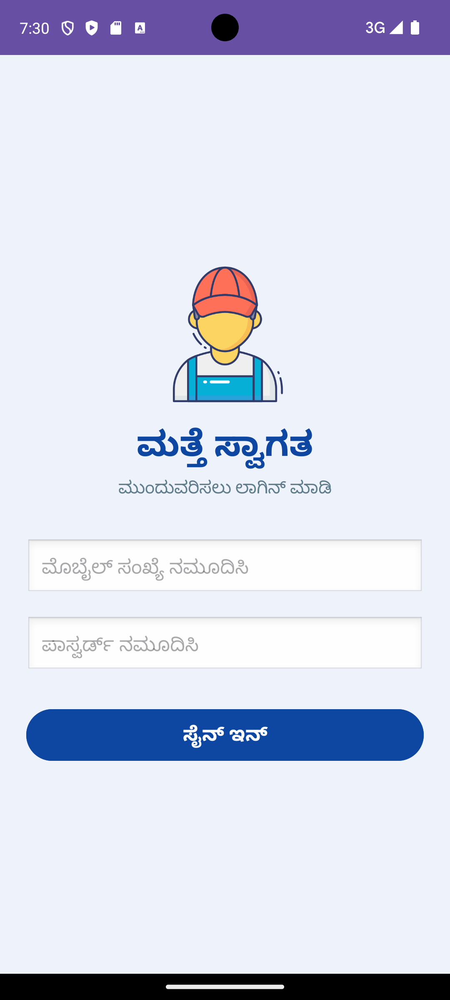
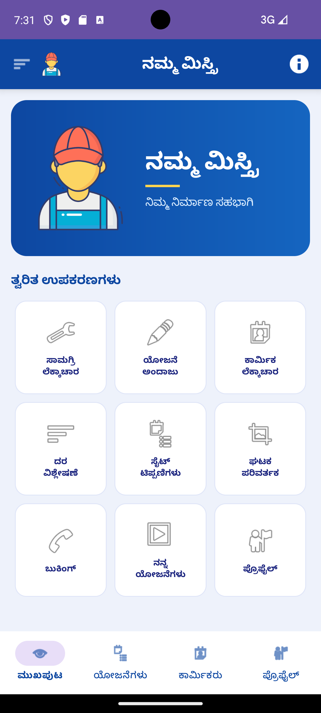

Namma Mistri – Construction Management Android Application
Overview

Namma Mistri is an Android-based construction management application developed to assist users in managing construction-related activities efficiently. The application provides tools for material calculation, labour estimation, project management, rate analysis, unit conversion, booking services, and site note management within a single platform.

The application is developed using Kotlin and XML in Android Studio with a simple and user-friendly interface suitable for construction workers, contractors, and engineers.

Features
Material Calculator
Project Estimation
Labour Calculator
Rate Analysis
Site Notes Management
Unit Converter
Booking Services
My Projects Management
User Profile Section
Bottom Navigation Menu
Kannada Language Support
Attractive Welcome and Login Screens
Technologies Used
Kotlin
XML
Android Studio
Android SDK
GridLayout
ScrollView
BottomNavigationView
Intent Navigation
Application Modules
1. Welcome Screen

Displays application banner, labour image, title, and app description with Get Started button.

2. Login Screen

Allows users to sign in using mobile number and password validation.

3. Main Menu Screen

Provides dashboard access to all construction management tools.

4. Material Calculator

Calculates construction materials based on user input dimensions.

5. Labour Calculator

Calculates labour cost and workforce estimation.

6. Project Estimation

Provides estimated project cost calculation.

7. Rate Analysis

Displays construction rate analysis details.

8. Site Notes

Stores important construction site notes and updates.

9. Unit Converter

Converts construction measurement units.

10. Booking Module

Allows users to book labour and construction services.

Screenshots

Add application screenshots here.

Welcome Screen
Login Screen
Main Menu Screen
Booking Screen
Calculator Modules
Installation
Download the APK file
Install the APK on Android device
Enable "Install from Unknown Sources" if required
Open the application
APK Download

Download APK from GitHub Releases section.

Future Enhancements
Firebase Database Integration
Online Booking System
Live Labour Tracking
Multi-language Support
AI-based Cost Prediction
Cloud Data Storage
Admin Dashboard
Project Structure
app/
 ├── java/com/example/nammamistri/
 ├── res/layout/
 ├── res/drawable/
 ├── res/menu/
 ├── AndroidManifest.xml
Developed By

Kavina A C

Final Year Computer Science Engineering Student

License
